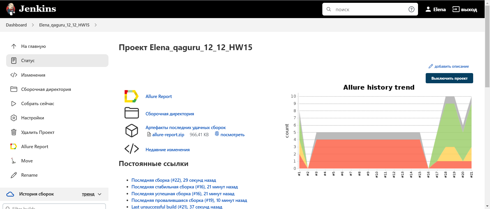
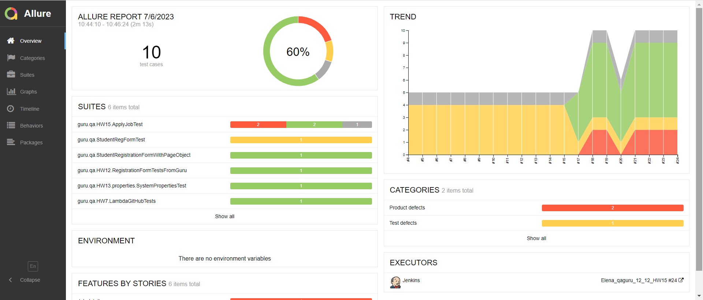
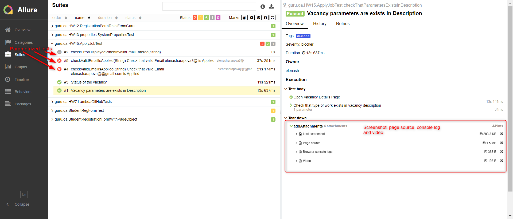
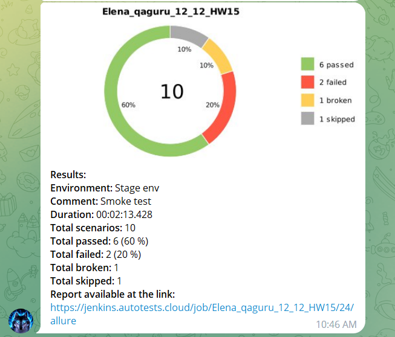

# Автоматизации тестирования страницы деталей вакансии QA Automation на сайте hh.ru
## :link: <a target="_blank" href="https://hh.ru/vacancy/55354866?query=QA%20automation%20engineer&from=vacancy_search_catalog&hhtmFrom=vacancy_search_catalog">hh.ru - Вакансия QA Automation</a>

## :page_with_curl: Содержание:

- <a href="#computer-сode_stack">Технологии и инструменты</a>
- <a href="#clipboard-реализованные-проверки">Реализованные проверки</a>
- <a href="#robot-сборки-в-Jenkins">Сборки в Jenkins</a>
- <a href="#keyboard-запуск-из-терминала">Запуск из терминала</a>
- <a href="#bar_chart-allure-отчет">Allure отчет</a>
- <a href="#robot-отчет-в-telegram">Отчет в Telegram</a>
- <a href="#film_projector-видео-пример-прохождения-тестов">Видео пример прохождения тестов</a>

## :computer: Технологии и инструменты
<p align="left">


</p>


## :clipboard: Реализованные проверки
- Проверка наличия текста "QA" в названии вакансии :heavy_check_mark:
- Проверка соответствия вакансии на необходимый тип работы: удаленная работа :heavy_check_mark:
- Проверка соответствия вакансии на наличие необходимого опыта: Selenoid :heavy_check_mark:
- Проверка перехода на ввод кода при вводе валидного Email и отклике на вакансию :x: (тест failed для отражения статуса failed в отчетах)
- Проверка наличия ошибки при вводе неверного формата Email :heavy_minus_sign: (тест Disabled для отражения статуса skipped в отчетах)


## :robot: Сборки в Jenkins
### <a target="_blank" href="https://jenkins.autotests.cloud/job/Elena_qaguru_12_12_HW15/">Параметризированная сборка в Jenkins со всеми тестами</a>
<p align="center">

</p>
<p align="center">

</p>

 

## :keyboard: Запуск из терминала
Локальный запуск всех тестов:
```
gradle clean test
```

Локальный запуск только тестов по вакансии(c тегом demoqa):
```
gradle clean demoqa
```

Удаленный запуск всех тестов:
```
clean
test
 -Dbrowser=${BROWSER}
 -DbrowserVersion=${BROWSER_VERSION}
 -DbrowserSize=${BROWSER_SIZE}
 -Dremote=${REMOTE}
```

Удаленный запуск только Smoke тестов (c тегом Smoke):
```
clean
demoqa
 -Dbrowser=${BROWSER}
 -DbrowserVersion=${BROWSER_VERSION}
 -DbrowserSize=${BROWSER_SIZE}
 -Dremote=${REMOTE}
```

## :bar_chart: Allure отчет
- ### Главный экран отчета
<p align="center">

</p>

- ### Страница с проведенными тестами
<p align="center">

</p>

## :robot: Отчет в Telegram
- ### Telegram notification message (all results)
<p align="center">

</p>


## :film_projector: Видео пример прохождения тестов
> К каждому тесту в отчете прилагается видео. Одно из таких видео представлено ниже.
<p align="center">
  